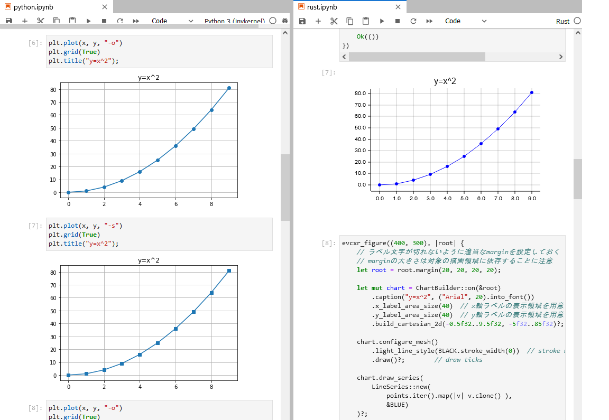

# Rust/Python plotting

matplotlibとRustのplottersの書き方を比較したノートブック置き場。



## Usage


```sh
docker build -t example .
docker run -p 8888:8888 -v ${PWD}:/app -it example
```

kick jupyterlab

```
$ jupyter lab --allow-root --ip 0.0.0.0
```

access to `http://127.0.0.1:8888/lab`


Dockerfileとその使い方は以下のgistを参考にした。

[Dockerfile Example of Rust and Python on Jupyter Lab](https://gist.github.com/vaaaaanquish/1f4fad6ae58645106d78dd6c2bed3702)